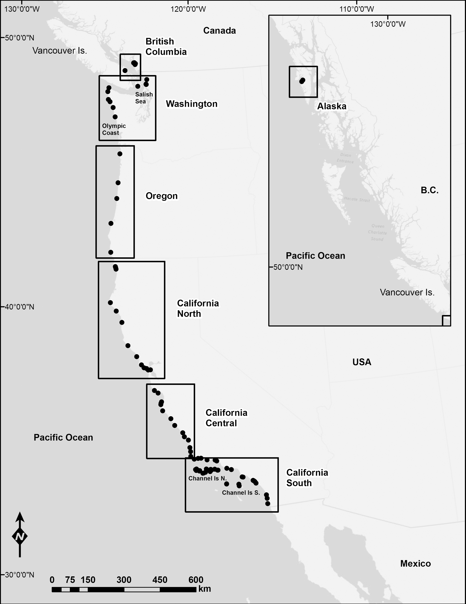
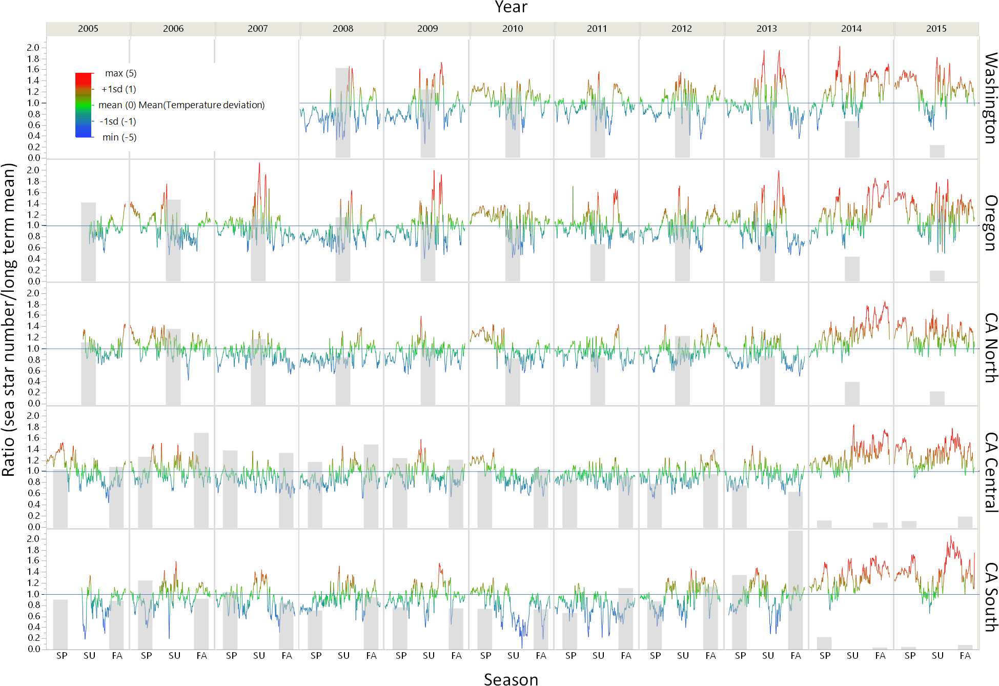
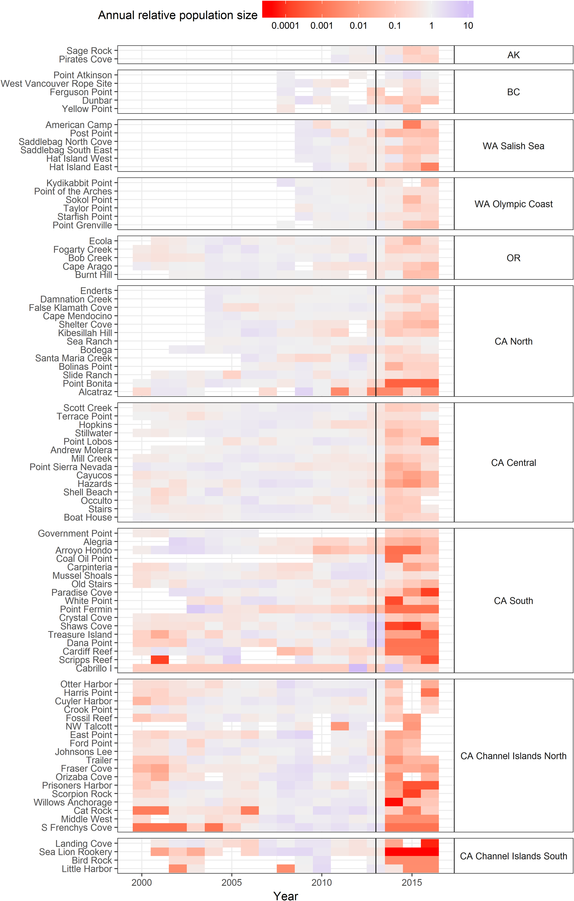

# Starfish Population
### Project: Sea Star
 This project focuses on the decline of the population of Sea Stars on the
 Western Coast of the United States and what causes the rapid decline.
* [Project Proposal](https://github.com/zarens131/Group-AA-03/wiki/Project-Proposal#starfish-population)

###### Team Members:
* Arya Goel
* Nicholas Wicklund
* Zachary Arenson

##### Affiliation:
Info-201: Technical Foundations of Informatics
The Information School
University of Washington
Autumn 2019

##### Introduction:
  * In the past decade, the Sea Star population has varied somewhat greatly
  because of a certain 'Sea Star Wasting Disease'.
  * The problem is that Sea Star numbers are dwindling so much that it's
  causing the shallow ocean ecosystem to become very imbalanced.
  * Why it Matters: Sea Stars are the most important predator in the shallow
  ecosystem. They eat almost anything they come across, which controls the
  whole ecosystem.
  * Many studies are being conducted along all of the West Coast of the United
  States, with the focus being mainly in California. Researchers don't know the
  cause of the disease yet, but in coming years, research may unveil the cause.

##### Research Question(s):
  * Is there a correlation between Sea Star Population density and areas of concentrated ocean heat?
  * With recent numbers in Sea Star population dwindling, how will the shallow
    ecosystems be affected and how much will that change the ocean?
  * How does the population of the other animals in the ecosystem appear to affect the sea star population?
  * Comparing the global warming temperatures to the general ecosystem where sea stars reside, is there a noticeable trend?
  * What correlation is found between the sea level and heat maps from the following datasets.
  * When comparing sea level and the oceans ecosystem populations, is there a noticeable trend?
##### Possible Data Set(s):
  [Ochre Sea Star Population](https://tuvalabs.com/datasets/ochre_sea_star_populations/activities) |
  [Sea Stars Distribution](https://onlinelibrary.wiley.com/doi/pdf/10.1111/ddi.12490) |
  [Ocean Heat](https://www.epa.gov/climate-indicators/climate-change-indicators-ocean-heat) |
  [Sea Surface Temperatures](https://www.epa.gov/climate-indicators/climate-change-indicators-sea-surface-temperature) |
  [Sea Level](https://www.epa.gov/climate-indicators/climate-change-indicators-sea-level)
#### **Information Visualizations:**
# 
#### _Fig 1. Heat map annual to relative population size_ (Source: Tuvalabs.com)
# 
#### _Fig 2. Temperature map from 2005 - 2015 within the ocean_ (Source: Onlinelibrary.wiley.com)
# 
#### _Fig 3. Map of study sites along the Pacific coast of North America. Sites are indicated by dots and study regions by labeled boxes_ (Source: Journals.plos.org)
# 
#### _Fig 4. Graph of ocean heat from 1955 - 2015_ (Source: epa.gov)
# 
#### _Fig 5. Graph of sea surface temperatures from 1880 - 2015_ (Source: epa.gov)
# 
#### _Fig 6. Graph of sea level from 1880 - 2015_ (Source: epa.gov)
# 
#### _Fig 7. Map of Sea Surface Temperature from 1901 - 2015_ (Source: epa.gov)
# 
#### _Fig 8. Map of Relative Sea Level Change from 1960 - 2015_ (Source: epa.gov)
--------------
##### **Teamwork Commitments:**
* As a group, we meet on Sundays from 1pm to 3pm.
  * Arya: Interested in the human influence towards the sea star population. Role - Researcher
  * Nicholas: Interested in the data trends between global warming and the sea star population Role - Logistics and Researcher
  * Zachary: Interested in how the sea star population has struggled to adapt to global warming. Role - Project Organizer and Researcher
* Using slack, canvas, and our phones we can communicate with each other easily. Our communication network is setup so that a group members with question or need their work checked can easily do so.
* As a group, we will be given tasks and goals, these will be checked during meeting times with each member. We will address communication challengers or work breakdowns by adequate pre planning a solution.

##### **Questions for Teaching Team**
* Are we required to format our reference resources in a specific way? If so, APA, MLA, or regular links?
* Is it okay for the README to have most of the proposal information? Or should it formatted and informationally different?
* I had to make the GitHub project public in order to create a Wiki, is this an issue?

##### **References**
1. [Large Scale Impacts](https://journals.plos.org/plosone/article?id=10.1371/journal.pone.0192870)
2. [Sea Stars Distribution](https://onlinelibrary.wiley.com/doi/pdf/10.1111/ddi.12490)
3. [Ochre Sea Star Population](https://tuvalabs.com/datasets/ochre_sea_star_populations/activities)
