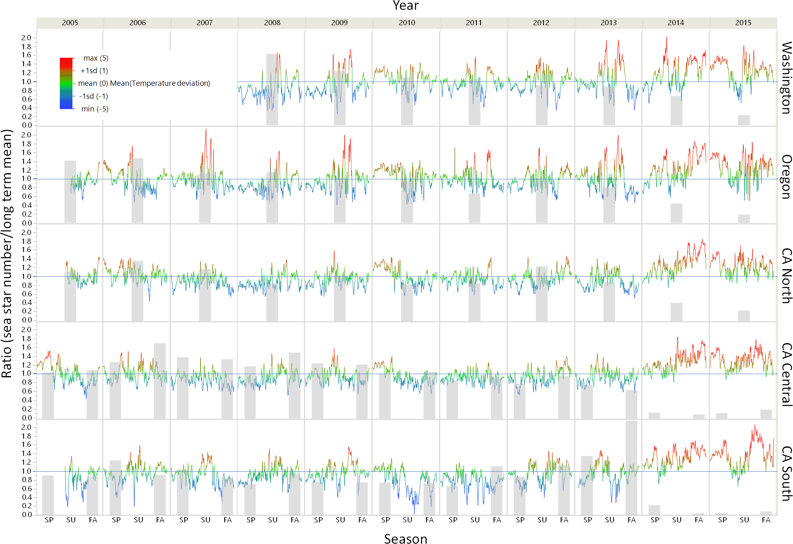
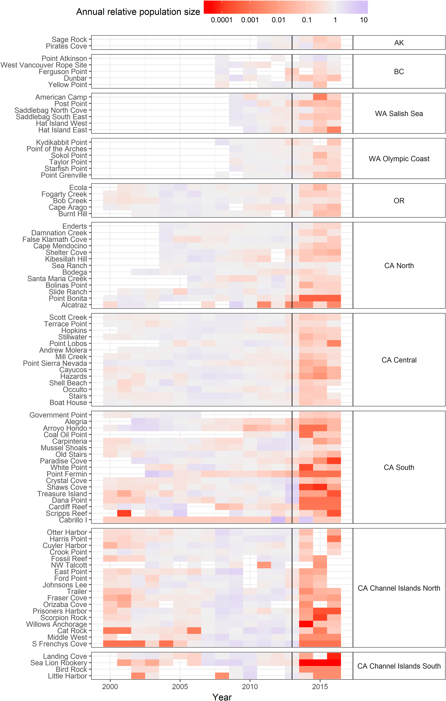

# Effects of Sea Star Wasting Disease on Sea Stars along the California Coast
#### By: Nicholas Wicklund
##### Introduction:
  * In the past decade, the Sea Star population has varied somewhat greatly
  because of a certain 'Sea Star Wasting Disease'.
  * The problem is that Sea Star numbers are dwindling so much that it's
  causing the shallow ocean ecosystem to become very imbalanced.
  * Why it Matters: Sea Stars are the most important predator in the shallow
  ecosystem. They eat almost anything they come across, which controls the
  whole ecosystem.
  * Many studies are being conducted along all of the West Coast of the United
  States, with the focus being mainly in California. Researchers don't know the
  cause of the disease yet, but in coming years, research may unveil the cause.

##### Research Question(s):
  * Does the rising water temperatures along the Western Coast of the United
  States have any impact on the Sea Star population?
  * With recent numbers in Sea Star population dwindling, how will the shallow
  ecosystems be affected and how much will that change the ocean?

##### Possible Data Set(s):
  * [Ochre Sea Star Population](https://tuvalabs.com/datasets/ochre_sea_star_populations/activities)
  * [Sea Stars Distribution](https://onlinelibrary.wiley.com/doi/pdf/10.1111/ddi.12490)

##### Information Visualizations:

##### References
* [Large Scale Impacts](https://journals.plos.org/plosone/article?id=10.1371/journal.pone.0192870)
* [Sea Stars Distribution](https://onlinelibrary.wiley.com/doi/pdf/10.1111/ddi.12490)
* [Ochre Sea Star Population](https://tuvalabs.com/datasets/ochre_sea_star_populations/activities)
